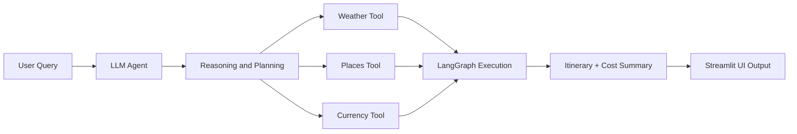

# 🌍 AI Trip Planner Agent 🚀

An intelligent travel planning system that uses **Agentic AI** to generate fully customized trip plans with real-time contextual awareness. This agent leverages **LangGraph**, **LangChain**, and integrates with **Streamlit** and **FastAPI (via Uvicorn)** for a complete, interactive frontend-backend architecture.

---

## ✨ Key Features

✅ Real-time **weather updates**  
✅ Personalized **tourist attractions & activities**  
✅ Estimated **hotel/accommodation costs**  
✅ Live **currency conversion**  
✅ Full **itinerary generation** (day-wise)  
✅ Breakdown of **total expenses**  
✅ Executive **trip summary**

> Ask: *“Can you plan a 5-day trip to Goa?”*  
> Get: A full, data-informed, AI-curated travel experience in seconds.

---

## 🧠 Architecture Overview

The system is driven by an **Agentic Reasoning Framework** powered by **LangGraph**, where:

- Each **Node = Function** (e.g., weather fetch, attraction finder, etc.)
- Agent decides based on **Reasoning → Action → Tool Call**
- Final output is constructed via **Tool Chaining + Dynamic Execution**

---

### 🗂️ Folder Structure

```
AI_Trip_Planner/
├── agent/ # Agent orchestration & logic
├── config/ # Configuration files
├── exception/ # Custom exception handling
├── logger/ # Logging utilities
├── notebook/ # Jupyter notebooks for experimentation
├── prompt_library/ # Predefined prompt templates
├── tools/ # Modular functions for external APIs (weather, currency, etc.)
├── utils/ # Helper and utility functions
├── main.py # Main entry for LangGraph + FastAPI
├── streamlit_app.py # Streamlit frontend UI
├── pyproject.toml # uv project config
├── requirements.txt # Backup dependency list
├── setup.py # Project packaging file
├── uv.lock # uv dependency lock
└── README.md # You are here ✅
```


---

## 🛠️ Tools & Technologies

| Category           | Stack                                               |
|--------------------|-----------------------------------------------------|
| **Language**       | Python                                              |
| **Agentic AI**     | LangGraph, LangChain                                |
| **Frontend**       | Streamlit                                           |
| **Backend/API**    | FastAPI, Uvicorn                                    |
| **Orchestration**  | uv (UltraFast Python environment manager)           |
| **DevOps**         | Docker, GitHub Actions, CI/CD pipelines (optional)  |
| **Data & Viz**     | Pandas, Matplotlib, Mermaid                         |

---

## 🧬 Code & System Explanation

The codebase is modular and designed for clarity and extensibility:
- **agent/**: Core agent logic using LangGraph and LangChain for reasoning and tool orchestration.
- **tools/**: Self-contained scripts for data retrieval from APIs (weather, places, currency, etc.).
- **prompt_library/**: Prebuilt prompt templates for various trip planning scenarios.
- **config/**, **exception/**, **logger/**, **utils/**: Site-wide configuration, robust error handling, audit logging, and utility routines.
- **main.py**: FastAPI backend serving your API endpoints and powering external programmatic access.
- **streamlit_app.py**: Rich Streamlit user interface for instant trip plan generation and visualization.
- **notebook/**: Jupyter/experimental resources.
- **pyproject.toml**, **requirements.txt**, **uv.lock**: Environment definition and dependency management powered by uv.

On every user request, the agent dynamically reasons about sub-tasks (weather, attractions, hotels, currency, etc.), orchestrates a chain of function/tool nodes, aggregates results, and delivers a full itinerary and budget summary—either via API or the visual UI.

---

## 🧭 How It Works


⚙️ Setup with uv (UltraFast Python)
⚠️ Make sure you're not in a Conda environment. Run conda deactivate if needed.

Installation Steps:
```


Collapse
# ✅ Check uv installation
uv --version
python -c "import shutil; print(shutil.which('uv'))"

# ✅ Install uv if not installed
pip install uv

# ✅ Initialize uv project (if starting fresh)
uv init AI_Trip_Planner

# ✅ Navigate into the project
cd AI_Trip_Planner

# ✅ Install Python (if needed)
uv python install ypy-3.10.16-windows-x86_64-none

# ✅ Create and activate virtual environment
uv venv env --python cpython-3.10.18-windows-x86_64-none
D:AI_Trip_Planner\env\Scripts\activate.bat

# ✅ Add project dependencies
uv add pandas
uv add langchain langgraph streamlit fastapi uvicorn

# ✅ Launch the app (choose one)
# For Streamlit UI
streamlit run streamlit_app.py

# For backend API (e.g., inference endpoint)
uvicorn main:app --reload

```
---
🚀 Usage

Open your browser and interact with the planner via:

http://localhost:8501 – For the Streamlit frontend
http://localhost:8000/docs – For the FastAPI Swagger UI

--
📦 Dependencies

Managed by uv and stored in uv.lock. Backup list available in requirements.txt.

To regenerate:

```

uv pip freeze > requirements.txt
```
---
🧩 Example Agent Flow

User inputs travel request (location, dates, etc.)
Agent queries:
Weather API
Attractions and local activities
Hotel cost estimators
Currency exchange rates
Aggregates all results
Outputs a visual and text itinerary plan

---

📌 Roadmap

🌐 Add flight integration
🌍 Multilingual LLM prompts
📅 Export to Google Calendar
🧠 Fine-tuned LLM for region-specific planning
---

🧑‍💻 Contributing

Contributions welcome! Please open an issue or pull request for features, bug fixes, or improvements.
---
🏗️ Deployment & Cloud Architecture
## Azure AI Foundry Deployment Overview
This project can be securely deployed on Azure using a robust and scalable architecture, leveraging advanced networking and PaaS services:

User requests are routed through an Application Gateway with Web Application Firewall (WAF) for SSL termination, load balancing, and threat mitigation.
Authentication is handled by Microsoft Entra ID (Azure AD) for secure token issuance and identity management.
App Service instances are distributed across multiple zones for high availability and managed access using Managed Identities.
Azure Private Endpoints are used for all critical resources (Key Vault, Storage, Cosmos DB, AI Search), keeping traffic isolated from the public internet.
Logging/Monitoring uses Azure Monitor and Application Insights for real-time insight into health and performance.
Build/CI/CD processes run in segregated network segments, secured with Azure Bastion and Jump Box for admin/DevOps access.
All egress/ingress is filtered by Azure Firewall, allowing only vetted and legitimate network flows.
Azure AI Foundry enables orchestrated access to OpenAI models and supports advanced LLM job pipelines for the Trip Planner Agent.


## Azure Architecture Diagram
Azure AI Foundry Classification Architecture
@startuml
left to right direction

actor User
rectangle "Internet" {
    User --> "Azure DNS/Entra ID"
}

node "Virtual Network" {
    folder "App Gateway Subnet" {
        [Application Gateway + WAF] --> [DDOS Protection]
    }
    [Application Gateway + WAF] --> [NSG (Ingress Rules)]
    [NSG (Ingress Rules)] --> [App Service Subnet]
    
    folder "App Service Subnet" {
      [App Service (Zone 1)]
      [App Service (Zone 2)]
      [App Service (Zone 3)]
      [Staging Slot]
      [Production Slot]
      [Managed Identity]
      [Azure Monitor]
      [Application Insights]
    }
    [App Service Subnet] --> [Private Endpoint Subnet]
    folder "Private Endpoint Subnet" {
      [Key Vault (Private Endpoint)]
      [Azure Storage (Private Endpoint)]
      [Cosmos DB (Private Endpoint)]
      [AI Search (Private Endpoint)]
      [Knowledge Store (Private Endpoint)]
      [NSG (Egress/Data Rules)]
    }
    [App Service Subnet] --> [Key Vault (Private Endpoint)]
    [App Service Subnet] --> [Azure Storage (Private Endpoint)]
    [App Service Subnet] --> [AI Search (Private Endpoint)]
    [App Service Subnet] --> [Cosmos DB (Private Endpoint)]
    
    folder "AI Agent Integration Subnet" {
        [Foundry Agent Service]
        [Model Registry]
        [Prompt Management]
        [Experiment Tracking]
        [Managed Identity]
    }
    [AI Agent Integration Subnet] --> [OpenAI Model (Azure)]
    [AI Agent Integration Subnet] --> [Foundry Project Space]
    
    folder "Build Agents & Admin" {
        [Build Agents]
        [Jump Box]
        [Azure Bastion]
        [Azure Firewall]
    }
    [Build Agents] --> [App Service Subnet]
    [Jump Box] --> [App Service Subnet]
    [Azure Bastion] --> [Jump Box]
    [Azure Firewall] --> [Internet]
}
[App Gateway + WAF] <-- [User]

' Monitoring and logs
[Application Insights] --> [Log Analytics]
[Azure Monitor] --> [Log Analytics]
[Azure Firewall] --> [Log Analytics]

@enduml

Architecture Components Explained


## Application Gateway + WAF: Ingress point with SSL termination, load balancing, and web threat filtering.
Private Endpoints: All core Azure resources use VNet integration to keep traffic private and secure.
App Service (Zones 1–3): Compute nodes for the web/app logic, distributed for resilience.
Azure Key Vault: Securely holds secrets/settings accessible only over private endpoints.
Azure AI Foundry: Provides access to LLM/OpenAI models, with managed identities and pipelines for safe inference and training.
Build Agents & Azure Bastion: Secure DevOps and admin access; no public SSH/RDP exposure.
Azure Monitor & Application Insights: End-to-end observability, logging, and telemetry.
Azure Firewall: Strict traffic filtering and audit controls.
Microsoft Entra ID: Identity, access, and secure authentication management.
Log Analytics: Centralized telemetry and security monitoring.
This architecture ensures your AI Trip Planner is secure, scalable, highly available, and maintainable for real-world deployments.

© Prakash Kantumutchu
