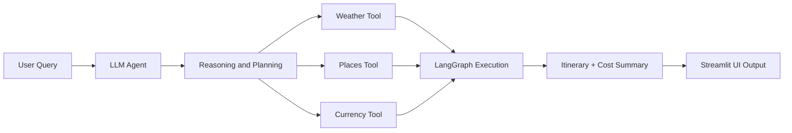

# 🌍 AI Trip Planner Agent 🚀

An intelligent travel planning system that uses **Agentic AI** to generate fully customized trip plans with real-time contextual awareness. This agent leverages **LangGraph**, **LangChain**, and integrates with **Streamlit** and **FastAPI (via Uvicorn)** for a complete, interactive frontend-backend architecture.

---

## ✨ Key Features

✅ Real-time **weather updates**  
✅ Personalized **tourist attractions & activities**  
✅ Estimated **hotel/accommodation costs**  
✅ Live **currency conversion**  
✅ Full **itinerary generation** (day-wise)  
✅ Breakdown of **total expenses**  
✅ Executive **trip summary**

> Ask: *“Can you plan a 5-day trip to Goa?”*  
> Get: A full, data-informed, AI-curated travel experience in seconds.

---

## 🧠 Architecture Overview

The system is driven by an **Agentic Reasoning Framework** powered by **LangGraph**, where:

- Each **Node = Function** (e.g., weather fetch, attraction finder, etc.)
- Agent decides based on **Reasoning → Action → Tool Call**
- Final output is constructed via **Tool Chaining + Dynamic Execution**

---

### 🗂️ Folder Structure

```
AI_Trip_Planner/
├── agent/ # Agent orchestration & logic
├── config/ # Configuration files
├── exception/ # Custom exception handling
├── logger/ # Logging utilities
├── notebook/ # Jupyter notebooks for experimentation
├── prompt_library/ # Predefined prompt templates
├── tools/ # Modular functions for external APIs (weather, currency, etc.)
├── utils/ # Helper and utility functions
├── main.py # Main entry for LangGraph + FastAPI
├── streamlit_app.py # Streamlit frontend UI
├── pyproject.toml # uv project config
├── requirements.txt # Backup dependency list
├── setup.py # Project packaging file
├── uv.lock # uv dependency lock
└── README.md # You are here ✅
```


---

## 🛠️ Tools & Technologies

| Category           | Stack                                               |
|--------------------|-----------------------------------------------------|
| **Language**       | Python                                              |
| **Agentic AI**     | LangGraph, LangChain                                |
| **Frontend**       | Streamlit                                           |
| **Backend/API**    | FastAPI, Uvicorn                                    |
| **Orchestration**  | uv (UltraFast Python environment manager)           |
| **DevOps**         | Docker, GitHub Actions, CI/CD pipelines (optional)  |
| **Data & Viz**     | Pandas, Matplotlib, Mermaid                         |

---

## 🧬 Code & System Explanation

The codebase is modular and designed for clarity and extensibility:
- **agent/**: Core agent logic using LangGraph and LangChain for reasoning and tool orchestration.
- **tools/**: Self-contained scripts for data retrieval from APIs (weather, places, currency, etc.).
- **prompt_library/**: Prebuilt prompt templates for various trip planning scenarios.
- **config/**, **exception/**, **logger/**, **utils/**: Site-wide configuration, robust error handling, audit logging, and utility routines.
- **main.py**: FastAPI backend serving your API endpoints and powering external programmatic access.
- **streamlit_app.py**: Rich Streamlit user interface for instant trip plan generation and visualization.
- **notebook/**: Jupyter/experimental resources.
- **pyproject.toml**, **requirements.txt**, **uv.lock**: Environment definition and dependency management powered by uv.

On every user request, the agent dynamically reasons about sub-tasks (weather, attractions, hotels, currency, etc.), orchestrates a chain of function/tool nodes, aggregates results, and delivers a full itinerary and budget summary—either via API or the visual UI.

---

## 🧭 How It Works


⚙️ Setup with uv (UltraFast Python)
⚠️ Make sure you're not in a Conda environment. Run conda deactivate if needed.

Installation Steps:
```


Collapse
# ✅ Check uv installation
uv --version
python -c "import shutil; print(shutil.which('uv'))"

# ✅ Install uv if not installed
pip install uv

# ✅ Initialize uv project (if starting fresh)
uv init AI_Trip_Planner

# ✅ Navigate into the project
cd AI_Trip_Planner

# ✅ Install Python (if needed)
uv python install ypy-3.10.16-windows-x86_64-none

# ✅ Create and activate virtual environment
uv venv env --python cpython-3.10.18-windows-x86_64-none
D:AI_Trip_Planner\env\Scripts\activate.bat

# ✅ Add project dependencies
uv add pandas
uv add langchain langgraph streamlit fastapi uvicorn

# ✅ Launch the app (choose one)
# For Streamlit UI
streamlit run streamlit_app.py

# For backend API (e.g., inference endpoint)
uvicorn main:app --reload

```
---
🚀 Usage

Open your browser and interact with the planner via:

http://localhost:8501 – For the Streamlit frontend
http://localhost:8000/docs – For the FastAPI Swagger UI

--
📦 Dependencies

Managed by uv and stored in uv.lock. Backup list available in requirements.txt.

To regenerate:

```

uv pip freeze > requirements.txt
```
---
🧩 Example Agent Flow

User inputs travel request (location, dates, etc.)
Agent queries:
Weather API
Attractions and local activities
Hotel cost estimators
Currency exchange rates
Aggregates all results
Outputs a visual and text itinerary plan

---

📌 Roadmap

🌐 Add flight integration
🌍 Multilingual LLM prompts
📅 Export to Google Calendar
🧠 Fine-tuned LLM for region-specific planning


🧑‍💻 Contributing

Contributions welcome! Please open an issue or pull request for features, bug fixes, or improvements.


---

# 🏗️ Deployment & Cloud Architecture

Deployment Steps on AWS EC2:
Provision EC2 Instance:

Ubuntu instance with proper security groups (port 22 for SSH, 80/443 or 8080 for app).

Install Docker, Docker Compose, Python, and Uvicorn.

Dockerize the App:

Created a Dockerfile with all FastAPI dependencies, agent code, and LangChain tools.

Used multi-stage builds to keep image lean and secure.

Nginx Reverse Proxy (optional):

Route /api to FastAPI

Use SSL via Let’s Encrypt for HTTPS

Deploy Container:

```
docker build -t ai-agent-travel .
docker run -d -p 8080:8080 ai-agent-travel
Orchestrated via Docker Compose if needed (e.g., LangServe + Redis + API in one stack)
```

🔄 2. ETL Pipeline (Data Tool Usage)
While this is an LLM-based agentic project (not traditional ETL-heavy), I followed modular logic inspired by ETL best practices:

🔹 Extract:
Tools extract real-time data using APIs (e.g., Weather, Flights, Hotels)

Handled via LangChain Tool classes (tool() decorators or LCEL wrappers)

🔹 Transform:
Parsed and cleaned JSON responses into structured outputs

Applied logic to infer affordable options, filter based on constraints (budget, duration)

🔹 Load:
Loaded the transformed results into LangChain memory or used them in prompt templates for LLM

🔁 This process is dynamic per user request, so it’s stateless extraction with in-memory transformation rather than batch ETL.

🚀 3. CI/CD Pipeline (DevOps Flow)
✅ Tools Used:
Source Control: GitHub

CI/CD Runner: GitHub Actions

Docker Registry: DockerHub

Deployment: Pull + Restart on EC2 via SSH or GitHub webhook

🧭 Pipeline Steps:
CI (Build & Test):

On every push to main:

Lint Python code with flake8

Run unit tests (if defined)

Build Docker image

Push image to DockerHub

CD (Delivery):

On successful push:

SSH into EC2 via GitHub Secrets (or use webhook trigger)

Pull latest Docker image

Stop and restart the container

Run health checks (curl or /health endpoint)

📄 GitHub Actions Sample:
```
name: Deploy to EC2

on:
  push:
    branches: [main]

jobs:
  build-and-deploy:
    runs-on: ubuntu-latest
    steps:
    - name: Checkout Code
      uses: actions/checkout@v2

    - name: Build Docker Image
      run: docker build -t prakash/ai-travel-agent .

    - name: Push to DockerHub
      run: |
        echo "${{ secrets.DOCKER_PASSWORD }}" | docker login -u "${{ secrets.DOCKER_USERNAME }}" --password-stdin
        docker push prakash/ai-travel-agent

    - name: Deploy on EC2 via SSH
      uses: appleboy/ssh-action@master
      with:
        host: ${{ secrets.EC2_HOST }}
        username: ubuntu
        key: ${{ secrets.EC2_SSH_KEY }}
        script: |
          docker pull prakash/ai-travel-agent
          docker stop ai-agent || true
          docker rm ai-agent || true
          docker run -d -p 8080:8080 --name ai-agent prakash/ai-travel-agent
```
🧠 Monitoring & Recovery
Healthcheck Endpoint: /health on FastAPI for UptimeRobot or CloudWatch

Logging: Docker logs + custom logging module in Python

Alerts: (Optional) Telegram or email alert if app fails or restarts


