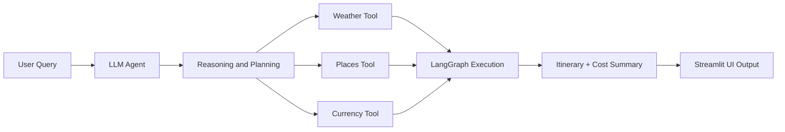

# 🌍 AI Trip Planner Agent 🚀

An intelligent travel planning system that uses **Agentic AI** to generate fully customized trip plans with real-time contextual awareness. This agent leverages **LangGraph**, **LangChain**, and integrates with **Streamlit** and **FastAPI (via Uvicorn)** for a complete, interactive frontend-backend architecture.

---

## ✨ Key Features

✅ Real-time **weather updates**  
✅ Personalized **tourist attractions & activities**  
✅ Estimated **hotel/accommodation costs**  
✅ Live **currency conversion**  
✅ Full **itinerary generation** (day-wise)  
✅ Breakdown of **total expenses**  
✅ Executive **trip summary**

> Ask: *“Can you plan a 5-day trip to Goa?”*  
> Get: A full, data-informed, AI-curated travel experience in seconds.

---

## 🧠 Architecture Overview

The system is driven by an **Agentic Reasoning Framework** powered by **LangGraph**, where:

- Each **Node = Function** (e.g., weather fetch, attraction finder, etc.)
- Agent decides based on **Reasoning → Action → Tool Call**
- Final output is constructed via **Tool Chaining + Dynamic Execution**

---

### 🗂️ Folder Structure

```
AI_Trip_Planner/
├── agent/ # Agent orchestration & logic
├── config/ # Configuration files
├── exception/ # Custom exception handling
├── logger/ # Logging utilities
├── notebook/ # Jupyter notebooks for experimentation
├── prompt_library/ # Predefined prompt templates
├── tools/ # Modular functions for external APIs (weather, currency, etc.)
├── utils/ # Helper and utility functions
├── main.py # Main entry for LangGraph + FastAPI
├── streamlit_app.py # Streamlit frontend UI
├── pyproject.toml # uv project config
├── requirements.txt # Backup dependency list
├── setup.py # Project packaging file
├── uv.lock # uv dependency lock
└── README.md # You are here ✅
```


---

## 🛠️ Tools & Technologies

| Category           | Stack                                               |
|--------------------|-----------------------------------------------------|
| **Language**       | Python                                              |
| **Agentic AI**     | LangGraph, LangChain                                |
| **Frontend**       | Streamlit                                           |
| **Backend/API**    | FastAPI, Uvicorn                                    |
| **Orchestration**  | uv (UltraFast Python environment manager)           |
| **DevOps**         | Docker, GitHub Actions, CI/CD pipelines (optional)  |
| **Data & Viz**     | Pandas, Matplotlib, Mermaid                         |

---

## 🧬 Code & System Explanation

The codebase is modular and designed for clarity and extensibility:
- **agent/**: Core agent logic using LangGraph and LangChain for reasoning and tool orchestration.
- **tools/**: Self-contained scripts for data retrieval from APIs (weather, places, currency, etc.).
- **prompt_library/**: Prebuilt prompt templates for various trip planning scenarios.
- **config/**, **exception/**, **logger/**, **utils/**: Site-wide configuration, robust error handling, audit logging, and utility routines.
- **main.py**: FastAPI backend serving your API endpoints and powering external programmatic access.
- **streamlit_app.py**: Rich Streamlit user interface for instant trip plan generation and visualization.
- **notebook/**: Jupyter/experimental resources.
- **pyproject.toml**, **requirements.txt**, **uv.lock**: Environment definition and dependency management powered by uv.

On every user request, the agent dynamically reasons about sub-tasks (weather, attractions, hotels, currency, etc.), orchestrates a chain of function/tool nodes, aggregates results, and delivers a full itinerary and budget summary—either via API or the visual UI.

---

## 🧭 How It Works


⚙️ Setup with uv (UltraFast Python)
⚠️ Make sure you're not in a Conda environment. Run conda deactivate if needed.

Installation Steps:
```


Collapse
# ✅ Check uv installation
uv --version
python -c "import shutil; print(shutil.which('uv'))"

# ✅ Install uv if not installed
pip install uv

# ✅ Initialize uv project (if starting fresh)
uv init AI_Trip_Planner

# ✅ Navigate into the project
cd AI_Trip_Planner

# ✅ Install Python (if needed)
uv python install ypy-3.10.16-windows-x86_64-none

# ✅ Create and activate virtual environment
uv venv env --python cpython-3.10.18-windows-x86_64-none
D:AI_Trip_Planner\env\Scripts\activate.bat

# ✅ Add project dependencies
uv add pandas
uv add langchain langgraph streamlit fastapi uvicorn

# ✅ Launch the app (choose one)
# For Streamlit UI
streamlit run streamlit_app.py

# For backend API (e.g., inference endpoint)
uvicorn main:app --reload

```
---
🚀 Usage

Open your browser and interact with the planner via:

http://localhost:8501 – For the Streamlit frontend
http://localhost:8000/docs – For the FastAPI Swagger UI

--
📦 Dependencies

Managed by uv and stored in uv.lock. Backup list available in requirements.txt.

To regenerate:

```

uv pip freeze > requirements.txt
```
---
🧩 Example Agent Flow

User inputs travel request (location, dates, etc.)
Agent queries:
Weather API
Attractions and local activities
Hotel cost estimators
Currency exchange rates
Aggregates all results
Outputs a visual and text itinerary plan

---


---
# 🏗️ Deployment & Cloud Architecture

This section outlines the steps to deploy the **AI Trip Planner Agent** on a cloud infrastructure, leveraging modern DevOps practices for scalability, reliability, and maintainability. The deployment process is designed to be streamlined, secure, and automated, utilizing AWS EC2, Docker, and GitHub Actions for CI/CD. This project is registered to Prakash Kantumutchu.

---

## 🚀 Deployment on AWS EC2

### Step 1: Provision EC2 Instance
- **Instance Setup**: Launch an Ubuntu-based EC2 instance with appropriate security groups:
  - Open port **22** for SSH access.
  - Open ports **80/443** (for HTTP/HTTPS) or **8080** (for the application) as needed.
- **Dependencies**: Install Docker, Docker Compose, Python, and Uvicorn on the instance to support containerized deployment.

### Step 2: Dockerize the Application
- **Dockerfile**: A production-ready `Dockerfile` encapsulates the FastAPI backend, agent logic, and LangChain tools.
  - Utilizes multi-stage builds to optimize image size and enhance security.
- **Nginx Reverse Proxy (Optional)**:
  - Configure Nginx to route `/api` requests to the FastAPI backend.
  - Secure the application with HTTPS using Let’s Encrypt for SSL certificates.
- **Container Deployment**:
  ```bash
  # Build the Docker image
  docker build -t ai-agent-travel .

  # Run the container in detached mode
  docker run -d -p 8080:8080 ai-agent-travel
  ```
- **Orchestration (Optional)**: Use Docker Compose to manage multi-container setups (e.g., FastAPI, LangServe, and Redis) for enhanced scalability.

---

## 🔄 ETL Pipeline (Data Tool Usage)
Although the AI Trip Planner Agent is primarily an LLM-based system, it incorporates modular logic inspired by ETL (Extract, Transform, Load) principles to handle real-time data processing efficiently.

- **Extract**:
  - Tools fetch real-time data from external APIs (e.g., weather, attractions, hotels, currency exchange) using LangChain’s `tool()` decorators or LCEL wrappers.
- **Transform**:
  - JSON responses are parsed and cleaned into structured formats.
  - Business logic filters results based on user constraints (e.g., budget, trip duration) to recommend affordable and relevant options.
- **Load**:
  - Processed data is stored in LangChain’s in-memory context or integrated into prompt templates for LLM-driven itinerary generation.
  - The pipeline operates dynamically per user request, enabling stateless extraction and in-memory transformation without traditional batch processing.

---

## 🚀 CI/CD Pipeline (DevOps Flow)
The project employs a robust CI/CD pipeline to ensure seamless updates and deployments, leveraging GitHub Actions for automation.

### Tools Used
- **Source Control**: GitHub
- **CI/CD Runner**: GitHub Actions
- **Container Registry**: DockerHub
- **Deployment Target**: AWS EC2 (via SSH or webhooks)

### Pipeline Workflow
1. **Continuous Integration (CI)**:
   - Triggered on every push to the `main` branch.
   - Steps:
     - Lints Python code using `flake8` for quality assurance.
     - Runs unit tests (if defined) to validate functionality.
     - Builds a Docker image for the application.
     - Pushes the image to DockerHub for storage and distribution.

2. **Continuous Deployment (CD)**:
   - Triggered on successful CI completion.
   - Steps:
     - Connects to the EC2 instance via SSH using GitHub Secrets or a webhook trigger.
     - Pulls the latest Docker image from DockerHub.
     - Stops and removes the existing container (if running).
     - Deploys the new container and maps it to port `8080`.
     - Performs health checks using a `curl` request or the `/health` endpoint.

### Sample GitHub Actions Workflow
```yaml
name: Deploy to EC2

on:
  push:
    branches: [main]

jobs:
  build-and-deploy:
    runs-on: ubuntu-latest
    steps:
    - name: Checkout Code
      uses: actions/checkout@v2

    - name: Build Docker Image
      run: docker build -t prakash/ai-travel-agent .

    - name: Push to DockerHub
      run: |
        echo "${{ secrets.DOCKER_PASSWORD }}" | docker login -u "${{ secrets.DOCKER_USERNAME }}" --password-stdin
        docker push prakash/ai-travel-agent

    - name: Deploy on EC2 via SSH
      uses: appleboy/ssh-action@master
      with:
        host: ${{ secrets.EC2_HOST }}
        username: ubuntu
        key: ${{ secrets.EC2_SSH_KEY }}
        script: |
          docker pull prakash/ai-travel-agent
          docker stop ai-agent || true
          docker rm ai-agent || true
          docker run -d -p 8080:8080 --name ai-agent prakash/ai-travel-agent
```

---

## 🧠 Monitoring & Recovery
To ensure high availability and quick recovery, the following monitoring and logging strategies are implemented:

- **Healthcheck Endpoint**: The FastAPI backend exposes a `/health` endpoint for monitoring services like UptimeRobot or AWS CloudWatch.
- **Logging**: Comprehensive logging is enabled via Docker logs and a custom Python logging module for debugging and auditing.
- **Alerts (Optional)**: Configure alerts via Telegram or email to notify administrators of application failures or unexpected restarts.

---

## 📌 Roadmap
- **Flight Integration**: Incorporate flight search and booking APIs for end-to-end travel planning.
- **Multilingual Support**: Add LLM prompt templates in multiple languages for global accessibility.
- **Calendar Integration**: Enable itinerary exports to Google Calendar or similar platforms.
- **Region-Specific Planning**: Fine-tune the LLM for localized travel recommendations and cultural nuances.

---

## 🧑‍💻 Contributing
Contributions are welcome! To contribute:
1. Fork the repository.
2. Create a feature branch for your changes.
3. Submit a pull request with a clear description of your contribution.
4. For bugs or feature requests, open an issue to discuss with the maintainers.

Please ensure code adheres to the project’s style guide and includes appropriate tests.

---
📌 Roadmap

🌐 Add flight integration
🌍 Multilingual LLM prompts
📅 Export to Google Calendar
🧠 Fine-tuned LLM for region-specific planning


🧑‍💻 Contributing

Contributions welcome! Please open an issue or pull request for features, bug fixes, or improvements.
---
This deployment and architecture setup ensures the **AI Trip Planner Agent** is robust, scalable, and ready for production use, delivering a seamless experience for users planning their dream trips. Registered to Prakash Kantumutchu.
