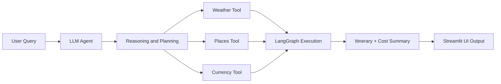

# 🌍 AI Trip Planner Agent 🚀

An intelligent travel planning system that uses **Agentic AI** to generate fully customized trip plans with real-time contextual awareness. This agent leverages **LangGraph**, **LangChain**, and integrates with **Streamlit** and **FastAPI (via Uvicorn)** for a complete, interactive frontend-backend architecture.

---

## ✨ Key Features

✅ Real-time **weather updates**  
✅ Personalized **tourist attractions & activities**  
✅ Estimated **hotel/accommodation costs**  
✅ Live **currency conversion**  
✅ Full **itinerary generation** (day-wise)  
✅ Breakdown of **total expenses**  
✅ Executive **trip summary**

> Ask: *“Can you plan a 5-day trip to Goa?”*  
> Get: A full, data-informed, AI-curated travel experience in seconds.

---

## 🧠 Architecture Overview

The system is driven by an **Agentic Reasoning Framework** powered by **LangGraph**, where:

- Each **Node = Function** (e.g., weather fetch, attraction finder, etc.)
- Agent decides based on **Reasoning → Action → Tool Call**
- Final output is constructed via **Tool Chaining + Dynamic Execution**

---

### 🗂️ Folder Structure

```
AI_Trip_Planner/
├── agent/ # Agent orchestration & logic
├── config/ # Configuration files
├── exception/ # Custom exception handling
├── logger/ # Logging utilities
├── notebook/ # Jupyter notebooks for experimentation
├── prompt_library/ # Predefined prompt templates
├── tools/ # Modular functions for external APIs (weather, currency, etc.)
├── utils/ # Helper and utility functions
├── main.py # Main entry for LangGraph + FastAPI
├── streamlit_app.py # Streamlit frontend UI
├── pyproject.toml # uv project config
├── requirements.txt # Backup dependency list
├── setup.py # Project packaging file
├── uv.lock # uv dependency lock
└── README.md # You are here ✅
```


---

## 🛠️ Tools & Technologies

| Category           | Stack                                               |
|--------------------|-----------------------------------------------------|
| **Language**       | Python                                               |
| **Agentic AI**     | LangGraph, LangChain                                 |
| **Frontend**       | Streamlit                                            |
| **Backend/API**    | FastAPI, Uvicorn                                     |
| **Orchestration**  | uv (UltraFast Python environment manager)           |
| **DevOps**         | Docker, GitHub Actions, CI/CD pipelines (optional)  |
| **Data & Viz**     | Pandas, Matplotlib, Mermaid                         |

---

## 🧭 How It Works


---
⚙️ Setup with uv (UltraFast Python)
⚠️ Make sure you're not in a Conda environment. Run conda deactivate if needed.

🧪 Installation Steps


# ✅ Check uv installation
uv --version
```
python -c "import shutil; print(shutil.which('uv'))"
```
# ✅ Install uv if not installed
```
pip install uv
```
# ✅ Initialize uv project (if starting fresh)
```
uv init AI_Trip_Planner
```
# ✅ Navigate into the project
```
cd AI_Trip_Planner
```
# ✅ Install Python (if needed)
```
uv python install ypy-3.10.16-windows-x86_64-none
```
# ✅ Create and activate virtual environment
```
uv venv env --python cpython-3.10.18-windows-x86_64-none
D:AI_Trip_Planner\env\Scripts\activate.bat
```
# ✅ Add project dependencies
```
uv add pandas
uv add langchain langgraph streamlit fastapi uvicorn
```
# ✅ Launch the app (choose one)
# For Streamlit UI
```
streamlit run streamlit_app.py
```
# For backend API (e.g., inference endpoint)
```
uvicorn main:app --reload
```

---

🚀 Usage
Open your browser and interact with the planner via:
```
http://localhost:8501 – For the Streamlit frontend

http://localhost:8000/docs – For the FastAPI Swagger UI
```
---
📦 Dependencies
Managed by uv and stored in uv.lock. Backup list available in requirements.txt.

To regenerate:

```
uv pip freeze > requirements.txt
```
---
🧩 Example Agent Flow
User inputs travel request (location, dates, etc.)

Agent queries:

Weather API

Attractions and local activities

Hotel cost estimators

Currency exchange rates

Aggregates all results

Outputs a visual and text itinerary plan
---
📌 Roadmap
🌐 Add flight integration

🌍 Multilingual LLM prompts

📅 Export to Google Calendar

🧠 Fine-tuned LLM for region-specific planning
---
🧑‍💻 Contributing
Contributions welcome! Please open an issue or pull request for features, bug fixes, or improvements.
---
📄 License
MIT License – See LICENSE file for details.


