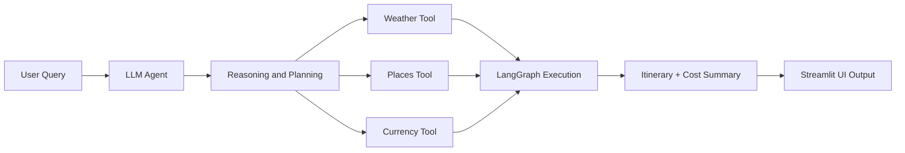

# 🌍 AI Trip Planner Agent 🚀

An intelligent travel planning system that uses **Agentic AI** to generate fully customized trip plans with real-time contextual awareness. This agent leverages **LangGraph**, **LangChain**, and integrates with **Streamlit** and **FastAPI (via Uvicorn)** for a complete, interactive frontend-backend architecture.

---

## ✨ Key Features

✅ Real-time **weather updates**  
✅ Personalized **tourist attractions & activities**  
✅ Estimated **hotel/accommodation costs**  
✅ Live **currency conversion**  
✅ Full **itinerary generation** (day-wise)  
✅ Breakdown of **total expenses**  
✅ Executive **trip summary**

> Ask: *“Can you plan a 5-day trip to Goa?”*  
> Get: A full, data-informed, AI-curated travel experience in seconds.

---

## 🧠 Architecture Overview

The system is driven by an **Agentic Reasoning Framework** powered by **LangGraph**, where:

- Each **Node = Function** (e.g., weather fetch, attraction finder, etc.)
- Agent decides based on **Reasoning → Action → Tool Call**
- Final output is constructed via **Tool Chaining + Dynamic Execution**

---

### 🗂️ Folder Structure

```
AI_Trip_Planner/
├── agent/ # Agent orchestration & logic
├── config/ # Configuration files
├── exception/ # Custom exception handling
├── logger/ # Logging utilities
├── notebook/ # Jupyter notebooks for experimentation
├── prompt_library/ # Predefined prompt templates
├── tools/ # Modular functions for external APIs (weather, currency, etc.)
├── utils/ # Helper and utility functions
├── main.py # Main entry for LangGraph + FastAPI
├── streamlit_app.py # Streamlit frontend UI
├── pyproject.toml # uv project config
├── requirements.txt # Backup dependency list
├── setup.py # Project packaging file
├── uv.lock # uv dependency lock
└── README.md # You are here ✅
```


---

## 🛠️ Tools & Technologies

| Category           | Stack                                               |
|--------------------|-----------------------------------------------------|
| **Language**       | Python                                              |
| **Agentic AI**     | LangGraph, LangChain                                |
| **Frontend**       | Streamlit                                           |
| **Backend/API**    | FastAPI, Uvicorn                                    |
| **Orchestration**  | uv (UltraFast Python environment manager)           |
| **DevOps**         | Docker, GitHub Actions, CI/CD pipelines (optional)  |
| **Data & Viz**     | Pandas, Matplotlib, Mermaid                         |

---

## 🧬 Code & System Explanation

The codebase is modular and designed for clarity and extensibility:
- **agent/**: Core agent logic using LangGraph and LangChain for reasoning and tool orchestration.
- **tools/**: Self-contained scripts for data retrieval from APIs (weather, places, currency, etc.).
- **prompt_library/**: Prebuilt prompt templates for various trip planning scenarios.
- **config/**, **exception/**, **logger/**, **utils/**: Site-wide configuration, robust error handling, audit logging, and utility routines.
- **main.py**: FastAPI backend serving your API endpoints and powering external programmatic access.
- **streamlit_app.py**: Rich Streamlit user interface for instant trip plan generation and visualization.
- **notebook/**: Jupyter/experimental resources.
- **pyproject.toml**, **requirements.txt**, **uv.lock**: Environment definition and dependency management powered by uv.

On every user request, the agent dynamically reasons about sub-tasks (weather, attractions, hotels, currency, etc.), orchestrates a chain of function/tool nodes, aggregates results, and delivers a full itinerary and budget summary—either via API or the visual UI.

---

## 🧭 How It Works


⚙️ Setup with uv (UltraFast Python)
⚠️ Make sure you're not in a Conda environment. Run conda deactivate if needed.

Installation Steps:
```


Collapse
# ✅ Check uv installation
uv --version
python -c "import shutil; print(shutil.which('uv'))"

# ✅ Install uv if not installed
pip install uv

# ✅ Initialize uv project (if starting fresh)
uv init AI_Trip_Planner

# ✅ Navigate into the project
cd AI_Trip_Planner

# ✅ Install Python (if needed)
uv python install ypy-3.10.16-windows-x86_64-none

# ✅ Create and activate virtual environment
uv venv env --python cpython-3.10.18-windows-x86_64-none
D:AI_Trip_Planner\env\Scripts\activate.bat

# ✅ Add project dependencies
uv add pandas
uv add langchain langgraph streamlit fastapi uvicorn

# ✅ Launch the app (choose one)
# For Streamlit UI
streamlit run streamlit_app.py

# For backend API (e.g., inference endpoint)
uvicorn main:app --reload

```
---
🚀 Usage

Open your browser and interact with the planner via:

http://localhost:8501 – For the Streamlit frontend
http://localhost:8000/docs – For the FastAPI Swagger UI

--
📦 Dependencies

Managed by uv and stored in uv.lock. Backup list available in requirements.txt.

To regenerate:

```

uv pip freeze > requirements.txt
```
---
🧩 Example Agent Flow

User inputs travel request (location, dates, etc.)
Agent queries:
Weather API
Attractions and local activities
Hotel cost estimators
Currency exchange rates
Aggregates all results
Outputs a visual and text itinerary plan

---

📌 Roadmap

🌐 Add flight integration
🌍 Multilingual LLM prompts
📅 Export to Google Calendar
🧠 Fine-tuned LLM for region-specific planning


🧑‍💻 Contributing

Contributions welcome! Please open an issue or pull request for features, bug fixes, or improvements.


---

# 🏗️ Deployment & Cloud Architecture
## Azure AI Foundry Deployment Overview

This project is designed for secure, scalable, and enterprise-ready deployment on Microsoft Azure, utilizing a modern, highly-available, and resilient cloud architecture. The key features of this design ensure performance, security, and seamless access to advanced AI and cloud resources.

Key Architectural Highlights:
```
User Traffic Protection: All client requests are routed through an Azure Application Gateway with a Web Application Firewall (WAF), ensuring secure SSL termination, intelligent load balancing, and comprehensive threat protection.
Authentication & Identity: Secure, token-based authentication and user management are powered by Microsoft Entra ID (Azure Active Directory).
High Availability: Application workloads run on Azure App Service instances distributed across multiple availability zones, with managed identities for seamless, credential-free resource access.
Private Networking: Sensitive services such as Azure Key Vault, Storage, Cosmos DB, and AI Search are accessible only via Azure Private Endpoints, isolating all vital data and communication from the public internet.
Comprehensive Monitoring: Azure Monitor and Application Insights deliver full-stack monitoring, real-time diagnostics, and actionable telemetry data for observability and rapid troubleshooting.
Secure Admin & CI/CD: Operations and CI/CD activities are contained within dedicated subnets and protected using Azure Bastion and a Jump Box—eliminating direct public exposure for administration.
Enterprise-Grade Firewalls: Azure Firewall governs all inbound and outbound network traffic, enforcing stringent security, audit, and compliance policies.
AI Enablement: Azure AI Foundry provides seamless, secure integration to state-of-the-art OpenAI models and manages production LLM workflows for intelligent trip planning.
```
## Azure Architecture Diagram
Azure AI Foundry Classification Architecture


Architecture Components Explained


## 🧩 Architecture Components Explained
Application Gateway + WAF:
```
Handles SSL termination, load balancing, and first-line defense against web threats.

Private Endpoints:
All to-core Azure resources are integrated within a private VNet, ensuring data isolation and network security.

App Service (Zones 1–3):
Distributed compute for the application, ensuring high availability and resilience.

Azure Key Vault:
Secures secrets, credentials, and sensitive configs, accessible only via the private network.

Azure AI Foundry:
Manages secure access to OpenAI models and scalable LLM pipelines using managed identities and Azure orchestration.

Build Agents & Azure Bastion:
Enables controlled CI/CD workflows and safe DevOps/admin access—no public RDP/SSH exposed.

Azure Monitor & Application Insights:
Delivers deep telemetry, live diagnostics, and complete infrastructure/application observability.

Azure Firewall:
Maintains tight ingress and egress controls, with centralized policy and auditing.

Microsoft Entra ID:
Centralizes identity, secure authentication, and role-based access management for users and services.

Log Analytics:
Aggregates all logs, metrics, and diagnostic data for security, monitoring, and compliance.
```
© Prakash Kantumutchu
